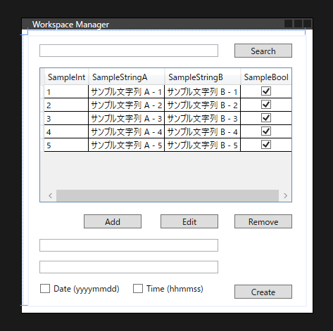
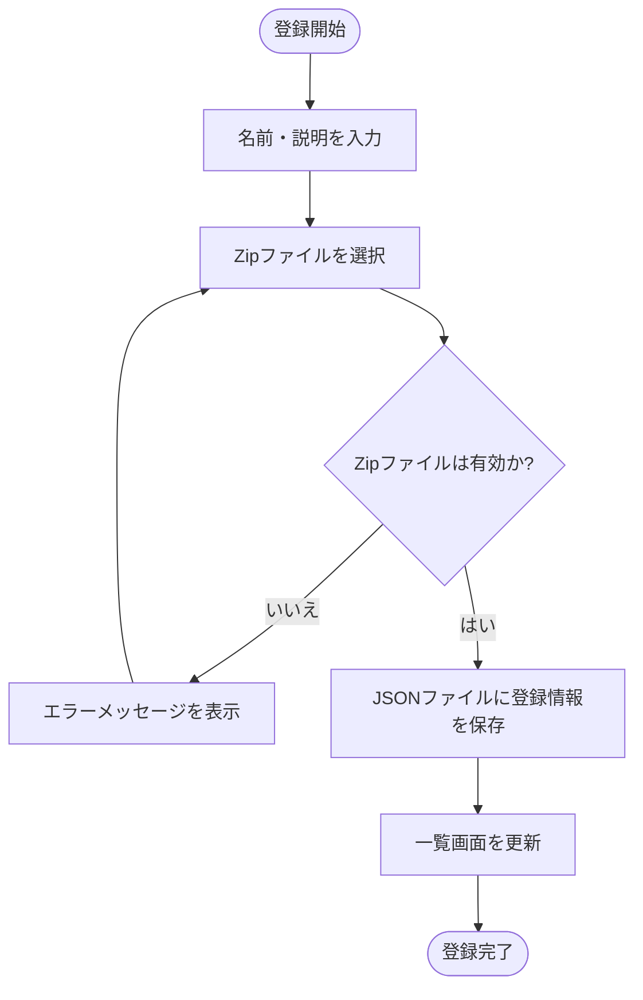
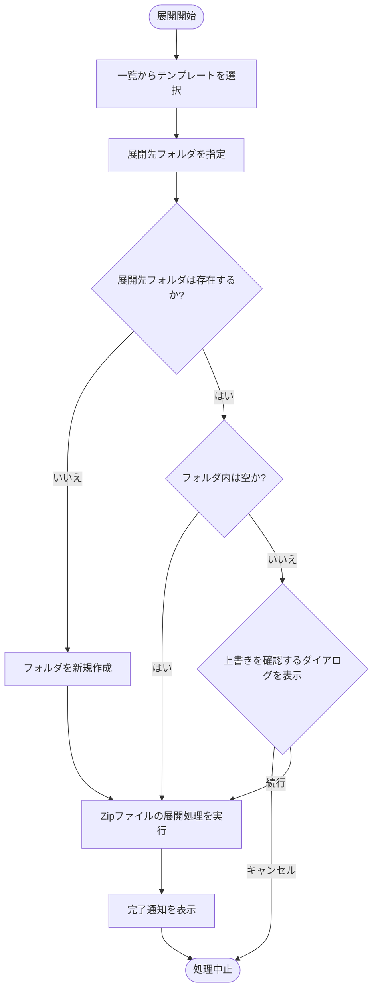

# メイン機能

## 1. 概要 (Overview)

### 1.1 背景・課題
開発作業やプロジェクトの開始にあたり、特定のディレクトリ構造やテンプレートファイルを初期状態として手動で配置する作業は手間がかかる。また、チーム開発や個人開発において、プロジェクトの初期構成が統一されず、管理が煩雑になる課題が存在する。

### 1.2 目的・解決策
事前に zip 化して保存しておいた作業フォルダ（テンプレート）を本アプリケーションに登録し、任意のフォルダへ即座に展開・作成する機能を提供する。これにより、標準化された作業環境の構築を迅速化し、手動コピーによるミスや手間の削減を実現する。

### 1.3 利用イメージ
ユーザーは、ベースとなるディレクトリ構成を zip 圧縮したファイルを作成する。本アプリケーションのメイン画面からその zip ファイルを作業フォルダテンプレートとして登録する。  
新しいプロジェクトを開始する際、一覧から登録済みのテンプレートを選択し、作成先のフォルダを指定して実行することで、一括でファイルとフォルダが展開される。  



## 2. 要求項目・制約事項 (Requirements & Constraints)

| 要求ID                          | 要求項目                                           |
| ------------------------------- | -------------------------------------------------- |
| [VR001ID001-01](#vr001id001-01) | `作業フォルダ（テンプレート）の管理および展開機能` |

### 2.1 VR001ID001-01
- **内容**: zip化された作業フォルダ（テンプレート）を登録・管理し、指定したフォルダへ展開・作成できること。  
- **詳細仕様**:  
  - **登録機能**:  
    - 中段の `Add` ボタンを押すことで、拡張子が `.zip` のみを対象としたファイルブラウザを開く。  
    - 選択されたZIPファイルの「ファイル名から拡張子（.zip）を除外した文字列」をテンプレート名とし、ZIPファイルのパスとともにSQLiteデータベースに登録する。  
    - 登録時、すでに同名のテンプレート（または同一パスのZIPファイル）が登録されている場合は、エラーダイアログを表示して登録処理を中断する。  
  - **検索機能**:  
    - 最上部の「Search」テキストボックスに検索キーワードを入力することで、DataGridの「Templates」列を動的にフィルタリング（部分一致検索）できる。  
    - 絞り込み実行後、DataGridの「No」列を1から振り直す。  
  - **一覧表示機能**:  
    - 登録されているテンプレートを `DataGrid` コントロールを使用してグリッド形式でメイン画面に表示する。複数選択可能。  
    - リストには「No（表示順の連番、動的採番）」、「Templates（テンプレート名）」、「Last Date（最終作成日 yyyy/mm/dd）」を表示する。  
    - **No列の採番ルール**: 検索絞り込み時やデータの追加・削除時には1から振り直すが、列ヘッダークリックによる「ソート（並び替え）」時は振り直しを行わず、各行のNo数値を保持したまま並び替える。  
  - **削除機能**:  
    - DataGridの一覧から選択されているデータを削除（`Remove` ボタン）できる。複数選択時は一括削除となる。  
    - 一覧で何も選択されていない場合、`Remove` ボタンは非活性とする。  
    - 削除を実行する前に、確認ダイアログ（「登録を解除しますか？」）を表示し、同意された場合のみ実行する。  
    - 削除時は、アプリケーションのDB管理データからのみ削除し、実際の zip ファイル等は削除しない。  
  - **展開・作成機能**:  
    - 以下の条件をすべて満たす場合のみ展開（Create）を実行できる（満たさない場合は `Create` ボタン非活性とする）。  
      1. DataGridの一覧から1つのテンプレートのみが選択されていること。  
      2. 下段のテキストボックス（ワークスペース名）が入力されていること。  
    - 下部上段のテキストボックス（または `Select` ボタンからの選択）でルートフォルダを指定し、下部下段のテキストボックスでベースとなるワークスペース名を入力する。  
    - **入力制限**:
      - 下段のテキストボックス（ワークスペース名）には、Windowsのフォルダ名として使用できない禁則文字（`\ / : * ? " < > |`）を入力不可とする。
      - 上段のテキストボックス（展開先パス）には、パスとして有効な文字（`\` や `:`）は許可し、それ以外の制御文字等を入力不可とする。  
    - 作成実行時、下部のチェックボックス（Date, Time）の選択状態に応じて、作成フォルダ名の先頭にプレフィックスを付与する。両方ONの場合は必ず `yyyymmdd_hhmmss_` の順序とする。  
    - 出力先パス（ルートフォルダ + プレフィックス付きワークスペース名）がすでに存在する場合、フォルダ内が完全に空であればそのまま展開を続行し、空でない場合はエラーダイアログを表示して処理を中断する。  
    - **ZIP解凍時の階層補正**: ZIPファイルの展開時、ZIPファイル名（拡張子なし）と同一の名前のフォルダがトップレベルに1つだけ存在する場合は、その親フォルダ階層を取り除き、中身のファイル・フォルダ群を直接出力先パスに配置する。  
    - エラー発生時は処理を中断し、対象となるエラーダイアログを表示する（エラーメッセージの詳細は後述の一覧表を参照）。  
    - ZIPの展開が正常に完了した後、使用したテンプレートの「Last Date（最終作成日）」をデータベース上で現在日付に更新し、完了通知を表示する。
    - 完了通知の後、作成された作業フォルダを Windows のエクスプローラで自動的に開く。  
  - **設定の保存・復元機能**:  
    - 画面起動時に、SQLiteデータベース（AppConfigテーブル）から「展開先フォルダパス」「Dateチェックボックス状態」「Timeチェックボックス状態」を読み込み復元する。  
    - データベースファイルの破損などにより読み込みに失敗した場合は、既存のデータベースファイルを破棄して再作成し、以下のデフォルト値を適用する。  
      - 検索（Search）キーワード: 空欄  
      - Date / Time チェックボックス: いずれも OFF  
      - 展開先フォルダパス: Windows標準の「ドキュメント」フォルダ  
    - 画面終了時、またはCreate実行時に、それらの状態を保存する。

### 2.2 エラーメッセージ一覧 (Error Messages)
本機能内で想定されるエラーと表示するメッセージの一覧を以下に定義する。

| エラーメッセージ内容 | 発生条件 |
| --- | --- |
| 同一のテンプレートフォルダ名が登録されています。<br>名前を変更して登録するか登録済みのテンプレートフォルダを削除して再度登録してください | **登録時（Add）**: 同名のテンプレート、または同一パスのZIPファイルがすでにDBに登録されている場合 |
| ファイルアクセスエラー | **登録時（Add）**: 選択されたZIPファイルが他のアプリケーションで使用中（ロック状態）などで読み取れない場合 |
| 有効なフォルダが指定されていません | **作成時（Create）**: 展開先ルートパスが空欄、または指定されたルートフォルダ（ドライブ等）が存在しない・削除されている場合 |
| 作成先のフォルダがすでに存在しています | **作成時（Create）**: 出力先パスがすでに存在し、かつフォルダ内が完全に空ではない場合 |
| 登録済みのテンプレートファイルが移動または削除されています | **作成時（Create）**: DBに登録されているZIPファイルが、OS上で移動・削除され見つからない場合 |
| 書き込み権限がありません | **作成時（Create）**: 展開先フォルダに対する書き込み権限がない場合 |
| ディスクの空き容量が足りません | **作成時（Create）**: 展開先のディスク空き容量が不足している場合 |
| フォルダーパスが長すぎるため作業フォルダの作成に失敗しました | **作成時（Create）**: 作成対象の絶対パスがWindowsのパス長制限（MAX_PATH: 通常260文字）を超過した場合 |
| 設定の保存に失敗しました | **DB処理時**: アプリ終了時や設定更新時など、ディスク容量不足やファイルロック等でAppConfig等への保存処理が失敗した場合 |

## 3. クラス設計・データ構造 (Architecture)

### 3.1 データ構造 (Data Model)
登録された作業フォルダの情報を保持するデータモデルを定義する。

#### WorkspaceTemplate
```csharp
public class WorkspaceTemplate
{
    public string TemplateName { get; set; } = string.Empty;
    public string TemplatePath { get; set; } = string.Empty;
    public string? LastCreatedDate { get; set; }
}
```

### 3.2 永続化設計 (Persistence)
登録情報や画面設定値は、1つの SQLite データベース（例: `TemplateManager.sqlite`）を使用して保存・管理する。  
- データベース構成およびテーブル定義の詳細は、別途「データベース仕様」を参照のこと。

### 3.3 サービスロジック (Service)
zip の展開処理を担当するクラスを定義する。

#### WorkspaceService
```csharp
public interface IWorkspaceService
{
    void ExtractTemplate(string zipFilePath, string destinationPath);
    bool ValidateZipFile(string zipFilePath);
}
```

### 3.4 主要なUIコントロール構成 (UI Controls)
画面はメインウィンドウ（`MainWindow.xaml`）で構成され、以下の主要なWPFコントロールを使用してUIを構築する。

- **ウィンドウ全体**:
  - `Window`: 固定サイズ（リサイズ不可、`ResizeMode="NoResize"`）。タイトルは「Workspace Manager」。
- **上部操作領域**:
  - `TextBlock` (Searchラベル用): 「Search」というテキストを表示する。
  - `TextBox` (検索キーワード入力用): 一覧を絞り込むためのキーワードを入力する。
- **データ一覧表示領域**:
  - `DataGrid`: 登録データをグリッド形式で一覧表示する。表示する列は以下の通り。
    - `No`: 数値（表示順の連番、画面表示時の動的採番）
    - `Templates`: 文字列（テンプレート名）
    - `Last Date`: 文字列（最終作成日 yyyy/mm/dd）
- **中段操作ボタン領域**:
  - `Button` (Add): データを追加する。
  - `Button` (Remove): 選択したデータを一覧から削除する。
- **下部入力・作成領域**:
  - `CheckBox` (Date (yyyymmdd)): 作成時に日付プレフィックスを付与するためのオプション。
  - `CheckBox` (Time (hhmmss)): 作成時に時間プレフィックスを付与するためのオプション。
  - `TextBox` (展開先パス入力用): 展開先のフォルダパスを入力・表示する（上段）。
  - `Button` (Select): 展開先フォルダを選択するダイアログを開く。
  - `TextBox` (追加情報入力用): フォルダ名などの追加項目として使用する（下段）。
  - `Button` (Create): 作業フォルダの新規作成を実行する。

## 4. 処理フロー・図解 (Workflow & Diagrams)

### 4.1 テンプレート登録フロー


### 4.2 テンプレート展開・作成フロー


## 5. AIエージェント向け特記事項 (AI Context)
- C# Net 10.0-windows をターゲットとするため、WPF の標準機能および `System.IO.Compression` パッケージを使用して zip 解凍を実装すること。  
- フォルダ選択には、.NET 8.0 / 10.0 で利用可能な `Microsoft.Win32.OpenFolderDialog` を使用することを推奨する。  
- 例外処理を適切に行い、zip ファイルの破損や書き込み権限エラーが発生した場合はユーザーに通知すること。  

## 6. 影響範囲・変更対象ファイル (Affected Files)
本機能の実装にあたり、追加・変更が予想されるファイルは以下の通り。  
- `WindowsWorkspaceManager/Models/WorkspaceTemplate.cs` (対応: VR001ID001-01)  
- `WindowsWorkspaceManager/Services/WorkspaceService.cs` (対応: VR001ID001-01)  
- `WindowsWorkspaceManager/ViewModels/MainViewModel.cs` (対応: VR001ID001-01)  
- `WindowsWorkspaceManager/MainWindow.xaml` (対応: VR001ID001-01)  
- `WindowsWorkspaceManager/MainWindow.xaml.cs` (対応: VR001ID001-01)  
